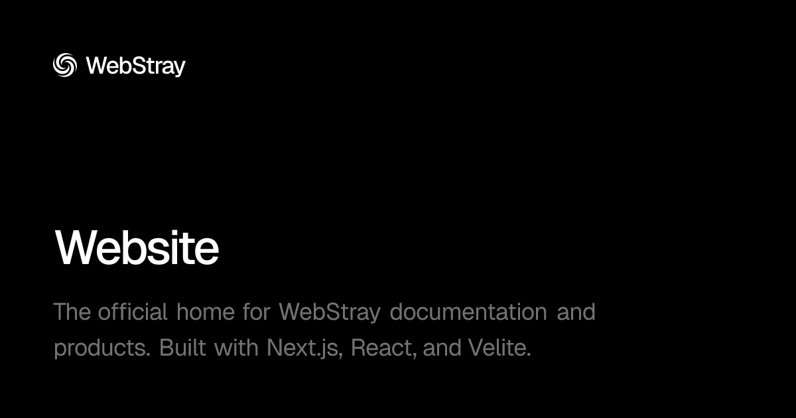

# WebStray Official Website

The official home for WebStray documentation and products.

## About

The WebStray website is the primary digital storefront and documentation platform for WebStray products, built using Next.js, React, and Velite as a type-safe content layer.

## Documentation

Detailed documentation is available on the [official WebStray website](https://webstray.com/docs/general/website).

## Built With

The WebStray website leverages a modern tech stack designed for content delivery and optimal user and developer experience:

### Framework & Content Layer

- **[Next.js](https://github.com/vercel/next.js)** – The React framework for the web, optimized for performance and SEO.
- **[React](https://github.com/facebook/react)** – Declarative UI framework for building a fast and reactive user interface.
- **[Velite](https://github.com/zce/velite)** – A powerful tool for turning Markdown/MDX into type-safe data collections.

### UI & UX

- **[shadcn/ui](https://github.com/shadcn-ui/ui)** – Accessible, high-quality components built with Radix UI.
- **[Tailwind CSS v4](https://github.com/tailwindlabs/tailwindcss)** – Utility-first CSS framework for UI styling.
- **[Motion](https://github.com/motiondivision/motion)** – Production-ready motion library for React.
- **[Lucide React](https://github.com/lucide-icons/lucide)** – Clean and consistent icon library.

## Local Development

To run the website in development mode with Velite watching for content changes, follow these steps:

#### 1. Clone the repository

```cmd
git clone https://github.com/webstraycom/website.git
cd website
```

#### 2. Install dependencies

```cmd
npm install
```

#### 3. Start the development server

```cmd
npm run dev
```

## Production Build

To generate the static content and build the optimized Next.js production bundle:

#### 1. Build for production

```cmd
npm run build
```

#### 2. Start the production server

```cmd
npm run start
```

## License

This project is licensed under the **MIT License**. See the [LICENSE](/LICENSE) file for details.
